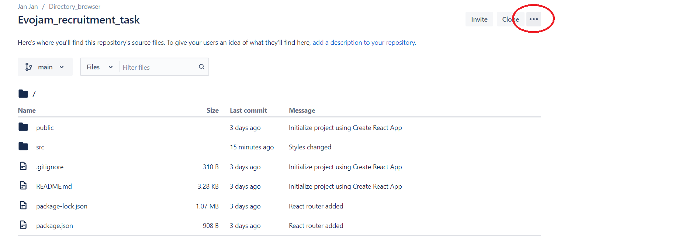
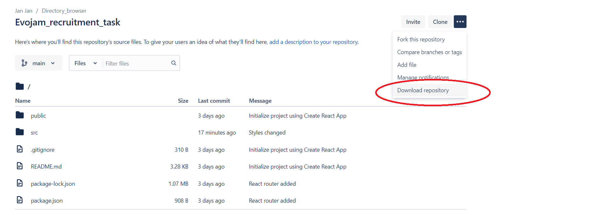

# Evojam recruitment task

## How to start up this project :

#### 1. First, click on the button with three dots on it

#### 2. Then select "Download repository" option

#### 3. Unzip downloaded folder to target location

#### 4. Install node.js from this link : https://nodejs.org/en/

#### 5. Open up a console (powershell/bash)

#### 6. Navigate to where "jan_krysztop-evojam_recruitment_task" is located

    cd /.../jan_krysztop-evojam_recruitment_task

#### 7. While inside this folder type in command:

    npm install

#### 8. And finally use this command to start local server and view project in the browser:

    npm start

## Content of the task:

Build a working version of the attached directory browser. 
The app allows users to click on directories and explore their contents. 
Content of a directory comes from the provided api. 
Use whatever technology you are most comfortable with, whether it's React, Angular or plain javascript. 
I'm interested to see how you divide and structure your code and how you implement api integration. 
Try to replicate the layout as closely as possible and fulfill all the functional requirements. 
Compatibility with Chrome is fine for this exercise - don't worry about IE / Firefox, etc. Finally, a short explanation of how to run the app and why you choose the technologies you choose would be very helpful.

#### API

Use this api url: https://fnp5vd20r2.execute-api.us-east-1.amazonaws.com/dev to fetch directory contents

#### Functional Requirements

1. on initial load fetch and display root directory
2. when user clicks on a directory fetch and display selected directory contents
3. display current directory path at the top of the screen
4. clicking on a directory name in the directory path should take user to that directory
5. display image icon for files with `jpg` extension, folder icon for directories and generic file icon for anything else (icons are taken from https://material.io/resources/icons )
6. truncate too long file names

#### Layout

This is the layout you should replicate.
The layout should adjust to screen width, meaning that the icons should only wrap to next row if there is not enough space.

